# Hello! 

---

## Lets talk about comms

---

# What is the *story* that *you* want to tell?

---

## How do we tell that story *in the open?*

---

## We have some *tools*

* Twitter
* Tumblr
* Medium/Code4Ca

---

## We need a *schedule*

* content calendar
* social media duty 
	* M-W | Tu-Th | F

---

# What does *culture change* look like?

---

## What do the digital standards look like *in practice?*

---

## How does a *multi-disciplinary team* work? 

---

# How do we *show the things?* 

---

## We can have a *newsletter*

* Highlight our work
* Share our successes
* Talk about challenges

---

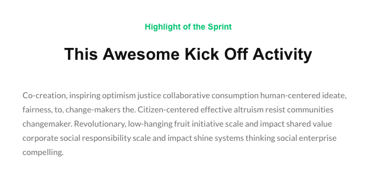

---

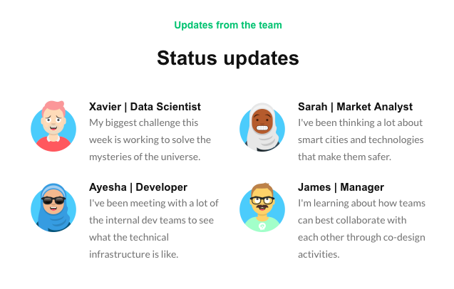

---

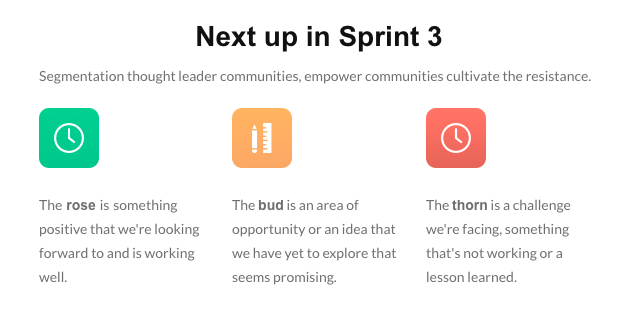

---

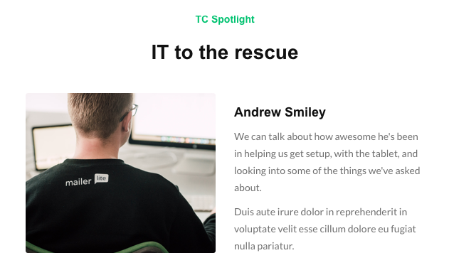

---

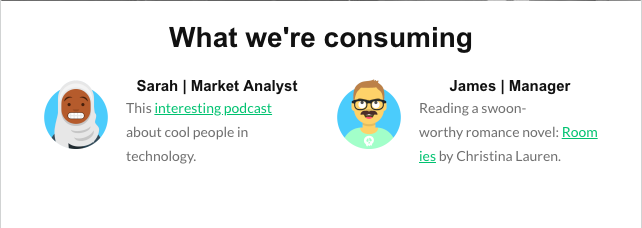

---

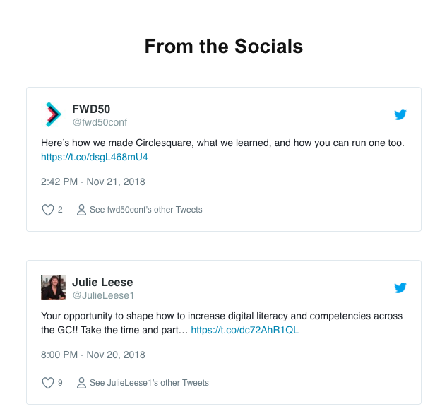

---

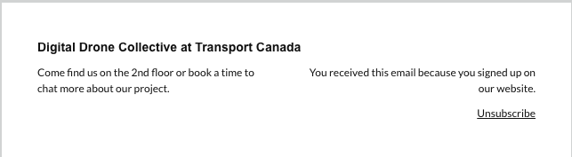

---

## And some *special* components!

---

---

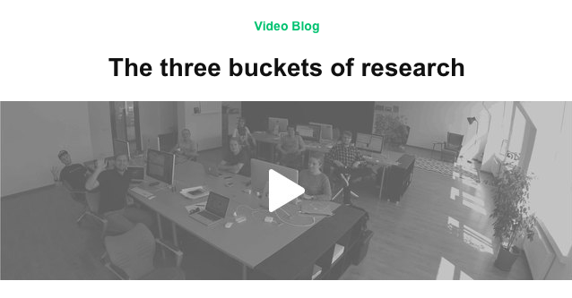

---

## Here are some *other* blocks

---

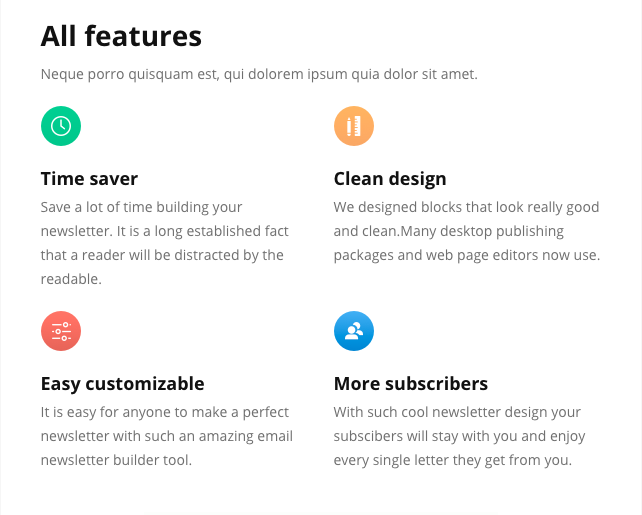

---

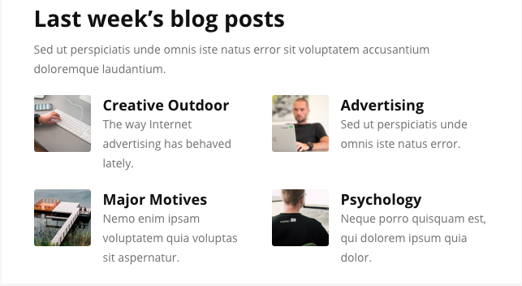

---

---
### *Feedback?*

## Test Newsletter
https://app.mailerlite.com/i3f5o1

## Components
http://bit.ly/ddc-nwslttr-01-feedback

---

# So what's *next?* 

---

## We need a *workflow* 

1. Plan
2. Write
3. Build
4. Review
5. Send 

---

## We need a *schedule* 

1. Plan -> Sprint planning
2. Write -> 1 week
3. Build -> 2 days
4. Review -> 2 days
5. Send -> Monday of new sprint

---

## For example *Sprint 2*

- Planning *Nov 30*
- Writing due: *Dec 10*
- Review period: *Dec 12-14*
- Send: *Dec 17*

---

# How do we know it’s *useful?* 

---

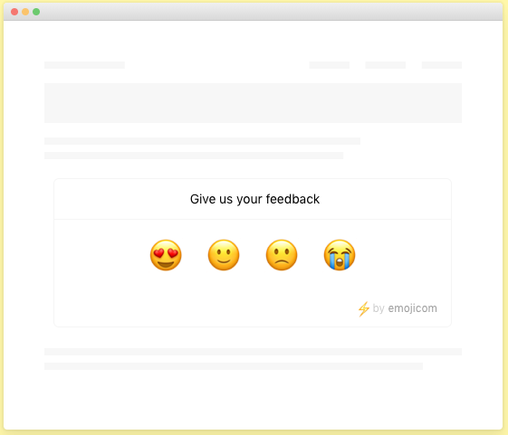

---

# Questions?